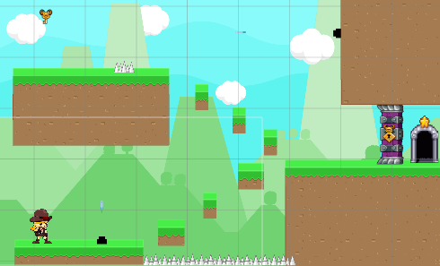

# Gun&Sword

### 게임제작동아리 '판도라 큐브' 정회원이 되기 위한 승급 프로젝트

## 개요
카우보이를 좋아하던 소녀가 꿈 속에서 무의식적으로 만든 세계를 헤쳐나가는 게임입니다.

장애물을 피해 다음 스테이지로 가기 위한 열쇠를 얻어서 문을 열고 나아가는 것이 목표입니다.

## 개발 언어 및 환경
* C#
* Unity
* Visual Studio

## 새로운 시도 (애니메이터 활용 및 간단한 연출 구현)
* 칼을 휘두르는 애니메이션의 특정 시간에 공격 범위에 해당하는 Collider 생성 함수가 적용되도록 함
* 특정 열쇠를 얻을 시, 해당 열쇠에 맞는 문으로 카메라가 전환되고 문이 열리는 애니메이션을 보이게 함

## 게임 플레이 화면

